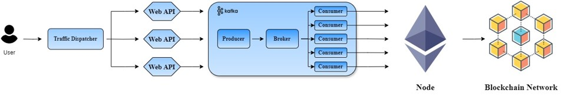

## Intro
The project evaluates the performance of two different buffering architectures—volatile buffering (MQTT) and persistent buffering (Kafka)—in blockchain gateways.

## Architechture
* volatile buffering (MQTT)

* persistent buffering (Kafka)

## Experimental Setup
Our study analyzes the transaction efficiency under different buffering mechanisms:

1. Varying the number of requests per user (10 to 100 requests per user).
2. Varying the number of concurrent users (1 to 80 users).
3. Measuring the average transaction time and standard deviation.

## Key Findings
* **Kafka (Persistent Buffering):** Higher stability and efficiency under high transaction loads.
* **MQTT (Volatile Buffering):** Faster access speed in low-load environments but lacks scalability.
* **Scalability Considerations:** Kafka remains stable even when increasing the number of users, while MQTT performance degrades.
